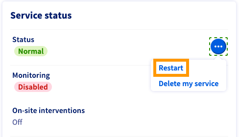
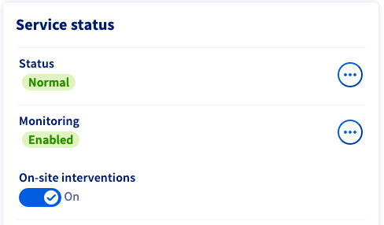

> [!primary]
> Tłumaczenie zostało wygenerowane automatycznie przez system naszego partnera SYSTRAN. W niektórych przypadkach mogą wystąpić nieprecyzyjne sformułowania, na przykład w tłumaczeniu nazw przycisków lub szczegółów technicznych. W przypadku jakichkolwiek wątpliwości zalecamy zapoznanie się z angielską/francuską wersją przewodnika. Jeśli chcesz przyczynić się do ulepszenia tłumaczenia, kliknij przycisk „Zaproponuj zmianę” na tej stronie.
> 

**Ostatnia aktualizacja z dnia 28/05/2021**

## Wprowadzenie

Serwer dedykowany to fizyczny serwer zlokalizowany w jednym z naszych centrów danych. W przeciwieństwie do rozwiązań hostingowych (określanych jako "hosting współdzielony"), którymi zarządza OVHcloud, w przypadku serwera dedykowanego to Ty ponosisz całkowitą odpowiedzialność za administrowanie nim.

**Poznaj podstawy korzystania z serwera dedykowanego**

<iframe width="560" height="315" src="https://www.youtube.com/embed/I2G6TkKg0gQ" frameborder="0" allow="accelerometer; autoplay; encrypted-media; gyroscope; picture-in-picture" allowfullscreen></iframe>

## Wymagania początkowe

- Posiadanie [serwera dedykowanego](https://www.ovhcloud.com/pl/bare-metal/){.external}
- Połączenie przez SSH (dostęp root) z systemem Linux lub jako administrator z systemem Windows
- Zalogowanie do [Panelu klienta OVHcloud](https://www.ovh.com/auth/?action=gotomanager&from=https://www.ovh.pl/&ovhSubsidiary=pl)

## W praktyce

Jeśli Twój serwer dedykowany jest po raz pierwszy skonfigurowany w trakcie procesu zamówienia, możesz wybrać system operacyjny do zainstalowania.

### Instalacja lub reinstalacja serwera dedykowanego

W prosty sposób możesz przeprowadzić reinstalację serwera i wybrać inny obraz systemu operacyjnego w [Panelu klienta](https://www.ovh.com/auth/?action=gotomanager&from=https://www.ovh.pl/&ovhSubsidiary=pl). W zakładce `Informacje ogólne`{.action} kliknij `...`{.action} naprzeciwko systemu operacyjnego, a następnie wybierz `Zainstaluj`{.action}.

{.thumbnail}

Na następnym ekranie wybierz `Zainstaluj szablon OVH`{.action} lub `Zainstaluj jeden z Twoich szablonów`{.action}, aby korzystać z szablonu instalacyjnego.

Aby zainstalować spersonalizowany obraz serwera, wybierz trzecią opcję `Zainstaluj na podstawie spersonalizowanego`{.action} obrazu. Zapoznaj się z przewodnikiem ["Korzystanie z funkcji Bring Your Own Image"](https://docs.ovh.com/gb/en/dedicated/bringyourownimage/), aby uzyskać więcej informacji na temat parametrów tej funkcji.

> [!primary]
>
> Niektóre zastrzeżone systemy operacyjne lub platformy, takie jak Plesk lub Windows, wymagają licencji, które generują dodatkowe koszty. Licencje możesz kupić [u OVHcloud](https://www.ovhcloud.com/pl/bare-metal/os/) lub u zewnętrznego resellera. Następnie zastosuj Twoją licencję do systemu operacyjnego lub za pomocą Panelu [klienta](https://www.ovh.com/auth/?action=gotomanager&from=https://www.ovh.pl/&ovhSubsidiary=pl).
>
> Wszystkie licencje możesz zarządzać w sekcji `Bare Metal Cloud`{.action} z `licencjami `{.action}. W tej sekcji możesz również zamawiać licencje lub dodawać istniejące licencje za pomocą przycisku `Operacje`{.action}.
>

Kliknij na `Dalej`{.action}, aby kontynuować.

{.thumbnail}

Po wybraniu `Instalacji z szablonu OVHcloud`{.action}, możesz wybrać system operacyjny z menu rozwijanego.

{.thumbnail}

Jeśli musisz zmienić układ partycji systemu operacyjnego, zaznacz kratkę "Personalizacja konfiguracji partycji", zanim klikniesz na `Dalej`{.action}.

{.thumbnail}

Po zakończeniu korekt kliknij Dalej, aby `uzyskać dostęp`{.action} do strony podsumowania.

#### Instalacja Real Time Monitoring (opcjonalnie) <a name="installrtm"></a>

Jeśli wybrałeś system operacyjny kompatybilny z GNU/Linux, pojawi się opcja aktywacji monitoringu w czasie rzeczywistym (RTM dla Real Time Monitoring).

{.thumbnail}

Ustaw kursor na `Włącz`{.action}, aby go zainstalować. Aby uzyskać więcej informacji na temat funkcji RTM, zapoznaj się z naszym przewodnikiem Instalacja [Real Time Monitoring (RTM)](../instalacja-rtm/).

#### Dodanie klucza SSH (opcjonalnie)

Jeśli instalujesz system operacyjny GNU/Linux, możesz dodać klucz SSH do ostatniego etapu procesu instalacji.

{.thumbnail}

Jeśli klucz SSH jest już zarejestrowany, pojawi się on w rozwijanym menu w polu "Klucze SSH" na dole. Jeśli nie, najpierw należy dodać jedną z nich w sekcji "Moje usługi".

Aby to zrobić, otwórz pasek boczny klikając swoją nazwę w prawym górnym rogu i użyj skrótu `Produkty i usługi`{.action}.

{.thumbnail}

W sekcji "Moje usługi" przejdź do zakładki `Klucze SSH`{.action} i kliknij `Dodaj klucz SSH`{.action}.

{.thumbnail}

Ponieważ chodzi o instalację serwera dedykowanego, z rozwijanego menu wybierz "Dedykowany" (kompatybilny również z serwerem VPS).

W nowym oknie wprowadź ID (wybraną nazwę) i klucz (typu RSA, ECDSA lub Ed25519) w odpowiednich polach.

{.thumbnail}

Aby uzyskać szczegółowe wyjaśnienie dotyczące generowania kluczy SSH, zapoznaj się z naszym [przewodnikiem](../tworzenie-klucze-ssh-dedykowane/).

> [!warning]
>OVHcloud świadczy usługi, za które jesteś odpowiedzialny w związku z ich konfiguracją i zarządzaniem. Jesteś więc odpowiedzialny za ich prawidłowe funkcjonowanie.
>
>Niniejszy przewodnik ma na celu pomoc w wykonywaniu bieżących zadań. W przypadku trudności lub wątpliwości związanych z administrowaniem, użytkowaniem lub wdrażaniem usług na serwerze zalecamy kontakt z wyspecjalizowanym dostawcą usług.
>

### Połączenie z serwerem

#### Linux

Po zakończeniu instalacji otrzymasz e-mail z instrukcjami dotyczącymi administracyjnego dostępu. Możesz połączyć się z serwerem za pomocą terminala poleceń lub z klientem trzecim, używając SSH, który jest bezpiecznym protokołem komunikacji.

Użyj poniższych przykładów, aby połączyć się z serwerem i zastąp dane identyfikacyjne własnymi identyfikatorami (adres IP i nazwa serwera mogą być zamienne).

**Przykład z root:**

```sh
ssh root@IP_Twojego_serwera
```

**Przykład dla wstępnie skonfigurowanego użytkownika:**

```sh
ssh root@nazwa_serwera
```

Więcej informacji na temat SSH znajdziesz w przewodniku "[Wprowadzenie do SSH](../ssh-wprowadzenie)".

#### Windows

Po zakończeniu instalacji otrzymasz e-mail z hasłem dostępu administratora (root). Użyj tych danych do logowania się do serwera przez RDP (**R**emote **D**esktop **P**rotocol). Po zalogowaniu Windows poprowadzi Cię przez całą początkową instalację.

### Restart serwera dedykowanego <a name="reboot"></a>

Restart może być niezbędny do aktualizacji konfiguracji lub rozwiązania problemu. Jeśli to możliwe, wykonaj "soft reboot" serwera za pomocą wiersza poleceń:

```sh
reboot
```

W każdej chwili możesz jednak wykonać "reboot hard" w Panelu [klienta OVHcloud](https://www.ovh.com/auth/?action=gotomanager&from=https://www.ovh.pl/&ovhSubsidiary=pl). W zakładce `Informacje ogólne`{.action} kliknij `...`{.action} naprzeciwko "Status" w strefie **Stan usług**, następnie `Restart`{.action} ponownie i `Zatwierdź`{.action} w oknie kontekstowym.

{.thumbnail}

### Bezpieczeństwo serwera dedykowanego

Zgodnie z informacją w części „Wprowadzenie” niniejszego przewodnika, jesteś administratorem Twojego serwera dedykowanego. Jesteś odpowiedzialny za Twoje dane i ich bezpieczeństwo. Aby uzyskać więcej informacji na temat bezpieczeństwa serwera, zapoznaj się z naszym przewodnikiem [Zabezpieczenie serwera dedykowanego](../porady-zabezpieczanie-serwera-dedykowanego/).

### Monitoring OVHcloud

Możesz włączyć lub wyłączyć monitoring serwera dedykowanego w zakładce `Informacje ogólne`{.action} w Twoim [Panelu klienta OVHcloud](https://www.ovh.com/auth/?action=gotomanager&from=https://www.ovh.pl/&ovhSubsidiary=pl). Wariant ten znajduje się w sekcji `Status usług`.

{.thumbnail}

- Jeśli **Monitoring** jest `Aktywny`, zostaniesz powiadomiony e-mailem o nieoczekiwanym działaniu serwera. Możesz wyłączyć te wiadomości za pomocą przycisku `...`{.action}.

- Jeśli włączysz opcję **Interwencje w centrum danych**, zezwolisz technikom centrum danych na sprawdzenie sprzętu na wypadek gdyby Twój serwer przestał odpowiadać na pingi.

> [!warning]
>
> Jeśli interwencje na miejscu są włączone (kursor jest wtedy na `On`{.action}, **wyłącz** opcję przed wykonaniem odpowiednich operacji na serwerze (testy sprzętowe, restart, itp.). Gdy funkcja "Monitoring" jest aktywna, otrzymasz zawsze automatyczne e-maile.
>

Więcej informacji na temat monitoringu OVHcloud znajdziesz w [tym przewodniku](https://docs.ovh.com/gb/en/dedicated/monitoring-ip-ovh/).

### Konfiguracja sieci

#### Network Bridging

Mostkowanie sieci to działanie podejmowane przez sprzęt sieciowy w celu utworzenia sieci łączonej z kilku sieci komunikacyjnych lub z kilku segmentów sieci. Tryb bridge jest odrębny od routingu, który pozwala sieciom na samodzielną komunikację przy jednoczesnym zachowaniu odrębności.

Jest to konfiguracja, która jest najczęściej wykorzystywana w wirtualizacji, aby umożliwić każdej maszynie wirtualnej posiadanie własnego publicznego adresu IP.

Więcej informacji na temat trybu bridge znajdziesz w naszym przewodniku: [Tryb bridge IP](../network-bridging/).

#### Alias IP

Alias IP to specjalna konfiguracja sieci serwera dedykowanego, która umożliwia przypisanie wielu adresów IP do jednego interfejsu sieciowego.  Dzięki temu serwer może ustanowić kilka połączeń z siecią, z których każde będzie służyło do innego celu. 

Szczegółowe instrukcje dotyczące konfiguracji aliasu IP znajdziesz w przewodniku "[Konfiguracja adresu IP jako aliasu](../network-ip-alias/)".

#### Konfiguracja IPv6

Wszystkie serwery dedykowane OVHcloud są dostarczane z blokiem /64 IPv6. Aby korzystać z adresów tego bloku, należy wprowadzić zmiany w konfiguracji sieci. Zapoznaj się z naszym przewodnikiem "[Konfiguracja IPv6](../siec-ipv6/)".

### Tryb Rescue

W przypadku każdego rodzaju problemu pierwszym krokiem do rozwiązania problemu jest uruchomienie serwera w trybie Rescue w Panelu [klienta OVHcloud](https://www.ovh.com/auth/?action=gotomanager&from=https://www.ovh.pl/&ovhSubsidiary=pl). Przed skontaktowaniem się z zespołami pomocy ważne jest zidentyfikowanie problemów z serwerem w tym trybie.

Zapoznaj się z przewodnikiem "[Włącz i użyj trybu Rescue](../ovh-rescue/)".

### Dostęp za pomocą IPMI

OVHcloud wdraża wszystkie serwery dedykowane za pomocą konsoli IPMI (Intelligent Platform Management Interface), która uruchamiana jest w przeglądarce lub z apletu Java. Konsola ta pozwala na połączenie bezpośrednio z serwerem, nawet jeśli nie ma on połączenia sieciowego. Jest to użyteczne narzędzie do rozwiązywania problemów, które mogły spowodować usunięcie serwera z sieci.

Aby uzyskać więcej informacji, zapoznaj się z naszym przewodnikiem "[Korzystanie z IPMI z serwerów dedykowanych](../uzywanie-ipmi-serwery-dedykowane/)".

### Backup Storage

Serwery dedykowane OVHcloud dysponują przestrzenią dyskową z kontrolowanym dostępem i są dostępne jako darmowa opcja. W przypadku utraty danych na samym serwerze preferowaną opcją jest wykonanie dodatkowej kopii zapasowej.

Aby włączyć i korzystać z opcji Backup Storage, zapoznaj się [z tym przewodnikiem](../usluga-backup-storage/).

## Sprawdź również

[Zabezpieczanie serwera dedykowanego](../porady-zabezpieczanie-serwera-dedykowanego/)

[Uruchamianie i korzystanie z trybu Rescue](../ovh-rescue/)

Przyłącz się do społeczności naszych użytkowników na stronie <https://community.ovh.com/en/>.
