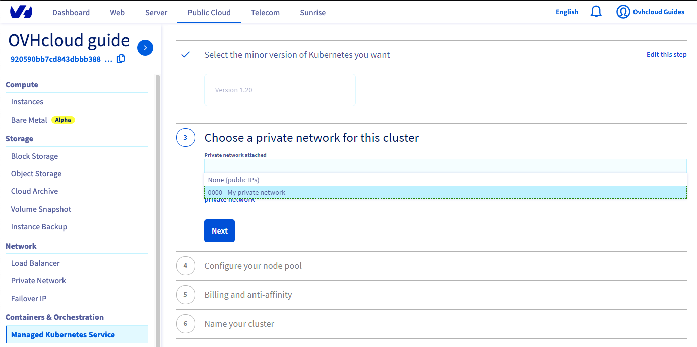

**Last updated 29th April 2021**

## Objective

OVHcloud Managed Kubernetes service provides you Kubernetes clusters without the hassle of installing or operating them. 

By default, your Kubernetes clusters will have public IPs. For some uses cases, or for security reasons, you could prefer having your Kubernetes cluster inside a private network. This guide will cover the integration of OVHcloud Managed Kubernetes clusters into vRack Private Networks.

## Requirements

A Public Cloud project in your OVHcloud account

## Instructions

First of all, you will need to set up vRack Private Network for your Public Cloud. To do it, please follow the [Configuring vRack for Public Cloud](../../public-cloud/public-cloud-vrack/) guide. Once you have created a vRack and added it into a Private Network, you can continue. 

Integrating a cluster into a vRack Private Network must be done at the third step on cluster creation, when you can choose an existing private network for the cluster:

{.thumbnail}

Your new cluster will be created inside the vRack Private Network you have chosen.

In the Managed Kubernetes Service Dashboard, you will see the cluster, with the chosen private network in the *Attached network* column:

{.thumbnail}

## Known limits

- All nodes within a Kubernetes cluster with vRack Private Network activated are available with that single Private Nework. (No public/private mix, single private network available).
- To expose some workload on the Internet, you can use the External Load Balancers that are now compatible with nodes in Vrack.
- The OVHcloud Public Cloud does not support security groups on vRack. This is planned to be supported late 2021.
- You will still see a public IPv4 address on your worker nodes. This IP won't be reachable from the Internet, and used exclusively for the administration of your nodes and its link to the Kubernetes control plane.

## Go further

Join our [community of users](https://community.ovh.com/en/).
