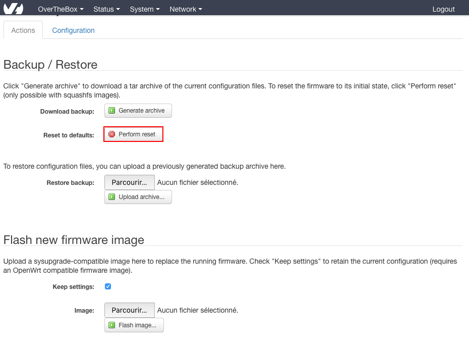
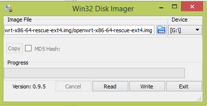
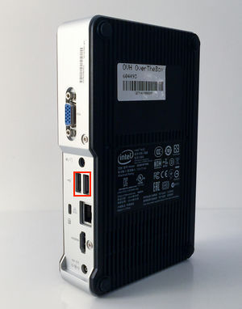

**Dernière mise à jour le 15/04/2021**

## Objectif

Découvrez comment réinitialiser votre équipement OverTheBox afin de revenir à la configuration par défaut.

## Prérequis

- Une **OverTheBox** fournie par OVHcloud

## En pratique

Plusieurs méthodes sont possibles. Le résultat final étant identique, vous pouvez donc choisir celle qui vous convient le mieux.

### Méthode 1 : réinitialisation physique

Appuyez de façon répétée, en moins de 2 secondes, 5 fois sur le bouton Power ON/OFF.

- Dans le cas d'une OverTheBox Intel :

{.thumbnail}

- Dans le cas d'une OverTheBox IT v1 :

{.thumbnail}

- Dans le cas d'un OverTheBox Plus :

{.thumbnail}

Attendez quelques minutes afin qu'**OverTheBox** soit de nouveau opérationnelle.

> [!success]
>
> Votre OvertheBox est maintenant réinitialisée, vous pouvez la réinstaller en suivant la procédure décrite dans les guides suivants :
>
> [Installation OverTheBox Intel ou IT v1](../intel-itv1-installation/)
>
> [Installation OverTheBox Plus ou IT v2](../plus-itv2-installation/)
>

### Méthode 2 : réinitialisation par l'interface

> [!warning]
>
> Cette méthode n'est disponible que si le firmware de votre OverTheBox est en version 0.6 ou supérieure.
>

- Rendez-vous sur [http://overthebox.ovh (192.168.100.1)](http://overthebox.ovh){.external}
- Cliquez sur **"System"**
- Cliquez sur **"Backup/Flash Firmware"**
- Cliquez sur **"Perform Reset"**

{.thumbnail}

- Attendez quelques minutes afin qu' **OverTheBox** soit de nouveau opérationnelle.

> [!success]
>
> Votre  OvertheBox  est maintenant réinitialisée, vous pouvez la réinstaller en suivant la procédure décrite dans les guides suivants :
>
> [Installation OverTheBox Intel ou IT v1](../intel-itv1-installation/)
>
> [Installation OverTheBox Plus ou IT v2](../plus-itv2-installation/)
>

### Méthode 3 : restauration complète par l'interface

Il est possible de réinstaller une nouvelle image depuis l'interface. Cette méthode restaurera complètement votre système.

- Téléchargez la dernière image sur votre ordinateur : [http://downloads.overthebox.net/stable/targets/x86/64/latest.img.gz](http://downloads.overthebox.net/stable/targets/x86/64/latest.img.gz){.external}
- Rendez-vous sur [http://overthebox.ovh (192.168.100.1)](http://overthebox.ovh){.external}
- Cliquez sur **"System"**
- Cliquez sur **"Backup/Flash Firmware"**

{.thumbnail}

Ensuite, dans la section  **Flash new firmware image** :

- Cliquez sur **"Parcourir"**
- Choisissez le fichier image que vous venez de télécharger
- Décochez la case **"Keep settings"**, afin de faire une véritable réinitialisation
- Cliquez sur **"Flash image"**

{.thumbnail}

- Attendez quelques minutes afin qu'**OverTheBox** soit de nouveau opérationnelle.

> [!success]
>
> Votre  OvertheBox  est maintenant réinitialisée, vous pouvez la réinstaller en suivant la procédure décrite dans les guides suivants :
>
> [Installation OverTheBox Intel ou IT v1](../intel-itv1-installation/)
>
> [Installation OverTheBox Plus ou IT v2](../plus-itv2-installation/)
>

### Méthode 4 : réinitialisation par le CLI

> [!warning]
>
> Cette méthode n'est disponible que si le firmware de votre OverTheBox est en version 0.6 ou supérieure.
>

Il est possible de réinitialiser l'**OverTheBox** depuis le CLI, accessible depuis une connexion SSH.

- Connectez vous en SSH à votre **OverTheBox** :

```bash
ssh root@overthebox.ovh
```

- Une fois connecté, entrez la commande suivante :

```bash
firstboot -y
```

- Attendez quelques minutes afin qu'**OverTheBox** soit de nouveau opérationnelle.

> [!success]
>
> Votre  OvertheBox  est maintenant réinitialisée, vous pouvez la réinstaller en suivant la procédure décrite dans les guides suivants :
>
> [Installation OverTheBox Intel ou IT v1](../intel-itv1-installation/)
>
> [Installation OverTheBox Plus ou IT v2](../plus-itv2-installation/)
>

### Méthode 5 : restauration complète depuis le CLI

Il est possible de réinstaller une nouvelle image depuis le CLI. Cette méthode restaurera complètement votre système.

- Connectez vous en SSH à votre **OverTheBox** :

```bash
ssh root@overthebox.ovh
```

- Une fois connecté, entrez la commande suivante :

```bash
otb-action-sysupgrade
```

- Attendez quelques minutes afin qu'**OverTheBox** soit de nouveau opérationnelle.

> [!success]
>
> Votre  OvertheBox  est maintenant réinitialisée, vous pouvez la réinstaller en suivant la procédure décrite dans les guides suivants :
>
> [Installation OverTheBox Intel ou IT v1](../intel-itv1-installation/)
>
> [Installation OverTheBox Plus ou IT v2](../plus-itv2-installation/)
>

### Méthode 6 : réinitialisation par clé USB

Il est possible de créer une clé USB bootable contenant l'image OverTheBox afin de réinitialiser complétement le système.

#### Création d'une clé USB bootable sous windows

- Téléchargez la dernière image **OverTheBox** sur votre ordinateur : [http://downloads.overthebox.net/stable/targets/x86/64/latest.img.gz](http://downloads.overthebox.net/stable/targets/x86/64/latest.img.gz){.external}
- Décompressez l'image grâce à un logiciel comme [winrar](https://www.rarlab.com/download.htm){.external} afin d'obtenir le fichier **.img**
- Branchez la clé USB sur l'ordinateur
- Téléchargez le logiciel [Win32 Disk Imager](https://win32diskimager.org/#download){.external} et ouvrez le.
- Cliquez sur **"Parcourir"** pour retrouver le fichier **.img**
- Sélectionnez la clé USB dans le champ **Device**
- Cliquez sur **"write"**
- Une fois la procédure terminée, cliquez sur **Exit**

{.thumbnail}

> [!success]
>
> La clé USB est maintenant prête à être utilisée pour flasher l'OverTheBox.
>

#### Création d'une clé USB bootable sous macOS

Toute l'opération se fera en ligne de commande, veuillez donc ouvrir le **Terminal**.

- Téléchargez la dernière image **OverTheBox** sur votre ordinateur, grace à la commande suivante :

```bash
curl -C - -O http://downloads.overthebox.net/stable/targets/x86/64/latest.img.gz
```

Il est ensuite impératif de connaitre le dossier désignant les partitions de votre clé USB, pour cela :

- Branchez la clé USB puis tapez la commande suivante :

```bash
diskutil list
```

Vous obtiendrez plusieurs rubriques /dev/disk**X** (où **X** est remplacé par un chiffre)
Le dossier correspondant à votre clé doit être le dernier et être désigné comme ceci : "/dev/disk **X**  (external, physical)".

{.thumbnail}

Maintenant que vous connaissez l'emplacement de votre clé USB, vous pouvez flasher cette dernière.

- Tapez la commande suivante (**en remplaçant X par le bon chiffre de votre clé**) :

```bash
gunzip -c latest.img.gz | dd of=/dev/diskX
```

Veuillez patienter le temps de l’exécution, **cela peut durer plusieurs minutes**.

> [!success]
>
> La clé USB est maintenant prête à être utilisée pour flasher l'OverTheBox.
>

#### Création d'une clé USB bootable sous Linux

Toute l'opération se fera en ligne de commande, veuillez donc ouvrir le **Terminal**.

- Téléchargez la dernière image **OverTheBox** sur votre ordinateur, grace à la commande suivante :

```bash
wget http://downloads.overthebox.net/stable/targets/x86/64/latest.img.gz
```

Il est ensuite impératif de connaitre le dossier désignant les partitions de votre clé USB, pour cela :

- Branchez la clé USB puis tapez la commande suivante :

```bash
df -h
```

Vous obtiendrez plusieurs rubriques /dev/sd**X** (où **X** est remplacé par une lettre)
Le dossier correspondant à votre clé doit être le dernier, vous pouvez vous en assurer en vérifiant que le nom de votre clé est bien affiché dans les dernières lignes.
Maintenant que vous connaissez l'emplacement de votre clé USB, vous pouvez flasher cette dernière.

- Tapez la commande suivante (**en remplaçant X par la bonne lettre de votre clé**) :
```bash
gunzip -c latest.img.gz | dd of=/dev/sdX
```

Veuillez patienter le temps de l’exécution, **cela peut durer plusieurs minutes**.

> [!success]
>
> La clé USB est maintenant prête à être utilisée pour flasher l'OverTheBox
>

#### Utilisation de la clé USB bootable

- Débranchez l'**OverTheBox** du courant électrique
- Branchez la clé USB bootable sur un des ports USB de l'**OverTheBox**

Dans le cas de l'OverTheBox Intel, la clé USB doit être branchée sur un des port USB **au dos** de l'appareil.

{.thumbnail}

Dans le cas d'une OverTheBox IT v1, la clé USB doit être branchée sur un des ports USB **noirs** :

{.thumbnail}

Dans le cas d'une OverTheBox Plus, la clé USB doit être branchée sur un des ports USB **en façade** :

{.thumbnail}

- Branchez l'**OverTheBox** sur le courant électrique, le boitier commence sa réinitialisation.
- Dans le cas de l'OverTheBox Intel, attendez que le **voyant de façade Power** soit éteint (cela peut prendre quelque minutes)
- Dans le cas de l'OverTheBox IT v1, attendez que le **voyant de façade Power** s'éteigne puis se rallume automatiquement (cela peut prendre quelque minutes)
- Dans le cas de l'OverTheBox Plus, attendez que le **voyant de façade Power** s'éteigne puis se rallume automatiquement (cela peut prendre quelque minutes)
- Débranchez la clé USB puis redémarrez votre **OverTheBox** .

> [!success]
>
> Votre  OvertheBox  est maintenant réinitialisée, vous pouvez la réinstaller en suivant la procédure décrite dans les guides suivants :
>
> [Installation OverTheBox Intel ou IT v1](../intel-itv1-installation/)
>
> [Installation OverTheBox Plus ou IT v2](../plus-itv2-installation/)
>

## Aller plus loin

N'hésitez pas à échanger avec notre communauté d'utilisateurs sur vos produits Télécom sur notre site [OVHcloud Community](https://community.ovh.com/c/telecom)
