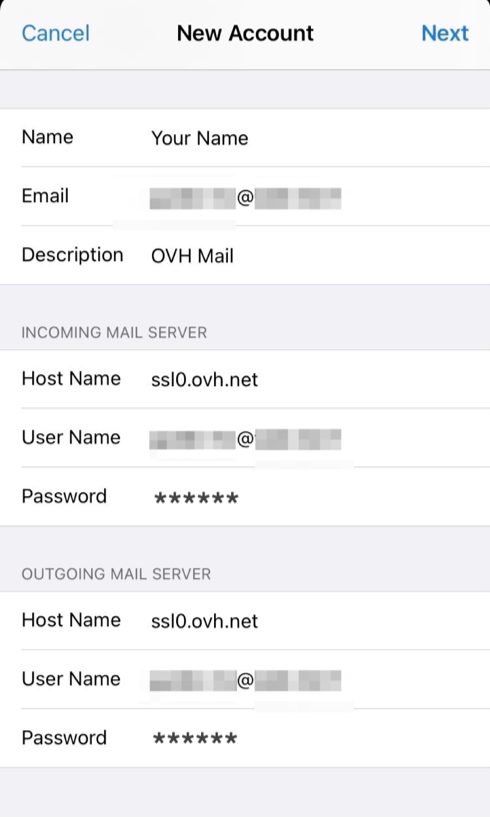

> [!primary]
> Esta traducción ha sido generada de forma automática por nuestro partner SYSTRAN. En algunos casos puede contener términos imprecisos, como en las etiquetas de los botones o los detalles técnicos. En caso de duda, le recomendamos que consulte la versión inglesa o francesa de la guía. Si quiere ayudarnos a mejorar esta traducción, por favor, utilice el botón «Contribuir» de esta página.
>

**Última actualización: 21/05/2021**

## Objetivo

Es posible configurar sus cuentas de correo electrónico en el cliente de correo que usted utilice, siempre que sea compatible, para enviar y recibir mensajes desde su dispositivo sin necesidad de una nueva aplicación.

**Esta guía explica cómo configurar una cuenta de correo electrónico en un iPhone o iPad utilizando la aplicación Mail.**

> [!warning]
>
> La configuración, la gestión y la responsabilidad de los servicios que OVHcloud pone a su disposición recaen sobre usted. Por lo tanto, usted deberá asegurarse de que estos funcionen correctamente.
>
> Esta guía le ayudará a realizar las tareas más habituales. No obstante, si tiene alguna duda le recomendamos que contacte con un proveedor de servicios especializado o con el editor del servicio. Nosotros no podremos asistirle. Para más información, consulte el apartado «Más información» de esta guía.
>

## Requisitos

- Disponer de una cuenta de correo electrónico incluida en un plan de [hosting de OVHcloud](https://www.ovh.com/world/es/hosting/){.external}).
- Tener la aplicación Mail instalada en su dispositivo iOS.
- Disponer del nombre de usuario y la contraseña de la cuenta de correo electrónico que quiera configurar.

## Procedimiento

### Añadir la cuenta

En la pantalla de bienvenida de su dispositivo, acceda a `Ajustes`{.action} (icono de rueda dentada). Según la versión de iOS, puede añadir una cuenta de diferentes formas:

- **Para iOS 7, 8, 9 y 10**: pulse `Correo electrónico, contactos, Calendario`{.action} y luego `Añadir cuenta`{.action}. A continuación, seleccione `Otra`{.action} y pulse `Añadir cuenta de correo`{.action}. Continúe en el paso 5 de la tabla siguiente.

- **Para iOS 11**: pulse `Cuentas y contraseñas`{.action} y luego `Añadir cuenta`{.action}. A continuación, seleccione `Otra`{.action} y pulse `Añadir cuenta de correo`{.action}. Continúe en el paso 5 de la tabla siguiente.

- **Para las versiones actuales**: siga las instrucciones de la tabla siguiente.

| | |
|---|---|
|{.thumbnail}|1. En `Ajustes`, vaya a `Mail`.    2. Pulse `Cuentas`.   3. Pulse `Añadir cuenta`.   3.4. Seleccione `Otro` abajo.|
|5. Pulse `Añadir cuenta de correo`.  6. Introduzca su **nombre**, dirección **de correo electrónico**, **contraseña** y una **descripción** de su cuenta.  7. Pulse `Siguiente`.|{.thumbnail}|
|{.thumbnail}|8. Seleccione el tipo de servidor de recepción `IMAP` (recomendado) o `POP`.  En las secciones `SERVIDOR DE RECEPCIÓN` y `SERVIDOR DE ENVÍO`, a pesar de la indicación "opcional", escriba:  - nombre del host **ssl0.ovh.net**  - su **dirección de correo electrónico completa** en nombre de usuario  - la contraseña de su dirección de correo electrónico|

Al finalizar la configuración, asegúrese de dejar `Mail`{.action} marcado para que la aplicación pueda utilizar la cuenta y haga clic en `Guardar`{.action}.

Si lo desea, puede realizar una prueba de envío desde la aplicación Mail de su dispositivo para comprobar que la cuenta esté bien configurada.

Si la aplicación le pide que introduzca de forma manual algunos datos técnicos en las preferencias de la cuenta, estos son los valores que debe utilizar para la solución de correo electrónico:

- **Configuración en IMAP**

|Tipo de servidor|Nombre del servidor|SSL|Puerto|
|---|---|---|---|
|Entrante|ssl0.ovh.net|Sí|993|
|Saliente|ssl0.ovh.net|Sí|465|

- **Configuración en POP**

|Tipo de servidor|Nombre del servidor|SSL|Puerto|
|---|---|---|---|
|Entrante|ssl0.ovh.net|Sí|995|
|Saliente|ssl0.ovh.net|Sí|465|

### Utilizar la dirección de correo

Una vez que haya configurado la dirección de correo electrónico, ya puede empezar a utilizarla enviando y recibiendo mensajes.

OVHcloud ofrece una aplicación web con la que podrá acceder a su dirección de correo electrónico desde el navegador de internet en la dirección <https://www.ovh.com/world/es/mail/>. Puede acceder con el nombre de usuario y la contraseña de su dirección de correo electrónico.

> [!primary]
>
> Si necesita ayuda para recibir o enviar mensajes de correo, consulte nuestras [FAQ en los servicios de correo de OVHcloud](https://docs.ovh.com/us/es/emails/correo-electronico-faq/).
>

## Más información

[Configurar una cuenta Exchange en iPhone o iPad](https://docs.ovh.com/es/microsoft-collaborative-solutions/configuracion-ios-iphone-ipad/){.external}

[FAQ e-mails](https://docs.ovh.com/us/es/emails/correo-electronico-faq/)

Interactúe con nuestra comunidad de usuarios en <https://community.ovh.com/en/>.
