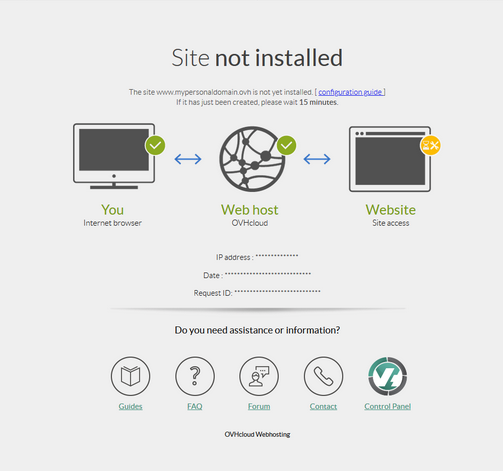

> [!primary]
> Tłumaczenie zostało wygenerowane automatycznie przez system naszego partnera SYSTRAN. W niektórych przypadkach mogą wystąpić nieprecyzyjne sformułowania, na przykład w tłumaczeniu nazw przycisków lub szczegółów technicznych. W przypadku jakichkolwiek wątpliwości zalecamy zapoznanie się z angielską/francuską wersją przewodnika. Jeśli chcesz przyczynić się do ulepszenia tłumaczenia, kliknij przycisk „Zaproponuj zmianę” na tej stronie.
>

**Ostatnia aktualizacja z dnia 18/05/2021**

## Wprowadzenie

W przeglądarce internetowej możesz wyświetlić nie zainstalowaną stronę **błędu**, zwłaszcza podczas pierwszej instalacji strony.

{.thumbnail}

**Dowiedz się, jak zidentyfikować i usunąć błąd "Strona nie została zainstalowana"**

> [!warning]
> OVHcloud udostępnia różnorodne usługi, jednak to Ty odpowiadasz za ich konfigurację i zarządzanie nimi. Ponosisz więc odpowiedzialność za ich prawidłowe funkcjonowanie.
>
> Oddajemy w Twoje ręce niniejszy przewodnik, którego celem jest pomoc w wykonywaniu bieżących zadań. W przypadku trudności zalecamy skorzystanie z pomocy wyspecjalizowanego webmastera lub kontakt z producentem oprogramowania. Niestety firma OVH nie będzie mogła udzielić wsparcia w tym zakresie. Więcej informacji znajduje się w sekcji [Sprawdź](#gofurther) ten przewodnik.

## Wymagania początkowe

- Posiadanie [Oferta Hostingu](https://www.ovh.pl/hosting/)
- Dostęp do [Panelu klienta OVHcloud](https://www.ovh.com/auth/?action=gotomanager&from=https://www.ovh.pl/&ovhSubsidiary=pl)
- Posiadanie również [Strefa DNS](../../domains/hosting_www_jak_edytowac_strefe_dns/), do której przypisana jest Twoja domena

## W praktyce

Niezainstalowana strona **Strona nie została zainstalowana** wyświetla się w dwóch sytuacjach :

1. Twoja domena nie występuje w części [MultiSite](../konfiguracja-multisite-na-hostingu/) hostingu.

2. Twoja domena nie jest powiązana z Twoim hostingiem za pośrednictwem `Strefa DNS`{.action}.

Kolejne kroki pozwolą Ci na poprawienie błędu `Strona nie została zainstalowana` w obu sytuacjach.

### Etap 1: sprawdź część MultiSite hostingu

W [Panelu klienta OVHcloud](https://www.ovh.com/auth/?action=gotomanager&from=https://www.ovh.pl/&ovhSubsidiary=pl) kliknij pozycję `Web Cloud`{.action}, a następnie `Hosting`{.action}.

Wybierz odpowiedni hosting z listy, następnie kliknij zakładkę `MultiSite`{.action}.

|Scenariusz|Co należy zrobić?|
|---|---|
|Nazwa Twojej strony wyświetla się w tabeli.|Jeśli właśnie dodałeś Twoją stronę WWW do hostingu, odczekaj około dwudziestu minut, a następnie odśwież cache przeglądarki. Jeśli komunikat `Strona nie została zainstalowana` nadal się pojawi, przejdź [do etapu drugiego](#checkdomainlink).|
|Domena lub subdomena przypisana do Twojej strony WWW nie wyświetla się w tabeli.|Dodaj Twoją domenę do `strony podpiętej`{.action} w opcji MultiSite, postępując zgodnie z sekcją poświęconą przewodnikowi [Instalacja kilku stron WWW na jednym hostingu - dodanie domeny lub subdomeny](../konfiguracja-multisite-na-hostingu/#etap-2-dodanie-domeny-lub-subdomeny).|
|Domena została usunięta z strony podpiętej w opcji MultiSite bez konieczności wykonywania przez Ciebie żadnych czynności.|Twoja domena lub strefa DNS mogą być zarządzane z innego konta. Dodaj Twoją domenę do strony podpiętej w opcji MultiSite, postępując zgodnie z instrukcjami w przewodniku [Instalacja kilku stron WWW na jednym hostingu - dodaj domenę zewnętrzną](../konfiguracja-multisite-na-hostingu/#etap-22-dodaj-domene-zewnetrzna).|

### Etap 2 : sprawdzić strefę DNS domeny 

> [!primary]
>
> Ten etap ma na celu sprawdzenie, czy Twoja domena poprzez `Strefa DNS`{.action} jest powiązana z hostingiem Twojej strony WWW.
> Więcej informacji na temat koncepcji DNS znajdziesz w przewodniku [Modyfikacja strefy DNS](../../domains/hosting_www_jak_edytowac_strefe_dns/#zrozumienie-pojecia-dns).

#### 2.1 Identyfikacja adresu IP hostingu OVHcloud

Aby odnaleźć adres IP, kliknij `Hosting` w kolumnie po lewej stronie [Panelu klienta OVHcloud](https://www.ovh.com/auth/?action=gotomanager&from=https://www.ovh.pl/&ovhSubsidiary=pl) i wybierz odpowiedni hosting.

{.thumbnail}

#### 2.2 Sprawdź adres IP zarejestrowany w strefie DNS Twojej domeny

Teraz sprawdź, czy adres IP Twojego hostingu wyświetla się w aktywnej strefie DNS Twojej domeny.

W tym celu przejdź do sekcji `Domeny`{.action}, wybierz domenę i przejdź do zakładki `Strefa DNS`{.action}.

|Scenariusz|Co należy zrobić?|
|---|---|
|W strefie DNS Twoja domena jest powiązana z adresem IP hostingu za pomocą wpisu typu A (dla IPv4) lub AAAA (dla IPv6) :  {.thumbnail}|Oznacza to, że konfiguracja Twojej domeny jest poprawna.  W związku z ostatnimi zmianami w serwerach DNS Twoja strona będzie wyświetlana w ciągu maksymalnie 48 godzin.  Pamiętaj, aby zrestartować urządzenia (komputer, smartfon, etc.) i usunąć cache przeglądarki.|
|W strefie DNS nie ma wpisów typu A lub AAAA łączących domenę z adresem IP Twojego hostingu. Lub istniejący wpis wskazuje na inny adres IP.|Dodaj nowy wpis A lub AAAA lub poprawij istniejący wpis zgodnie z [tym przewodnikiem](../../domains/hosting_www_jak_edytowac_strefe_dns/).|
|Twoja domena nie wyświetla się w części `Domeny`{.action} w Panelu klienta.  Lub zakładka `Strefa DNS`{.action} Twojej domeny wyświetla się w następujący sposób :  {.thumbnail}|Oznacza to, że Twoja domena nie jest zarządzana w Panelu klienta OVHcloud.  Określ operatora za pomocą narzędzia [WHOIS](https://www.ovh.pl/pomoc/narzedzia/check_whois.pl) i serwerów DNS.  W [tym przewodniku](../konfiguracja-multisite-na-hostingu/#etap-22-dodaj-domene-zewnetrzna) znajdziesz i zmodyfikuj odpowiednią strefę DNS.|
|Ostrzeżenie to wyświetla się w zakładce `Strefa DNS`{.action} :  {.thumbnail}|Należy zatem odpowiednio zmienić serwery DNS Twojej domeny zgodnie z [tym przewodnikiem](../../domains/hosting_www_informacje_na_temat_serwerow_dns/).|

## Sprawdź 

[Lista adresów IP klastrów i hostingów](../lista-adresow-ip-klastrow-i-hostingow-www/)

Jeśli chcesz uzyskać pomoc w zakresie korzystania z i konfiguracji Twoich rozwiązań OVHcloud, sprawdź nasze [oferty pomocy](https://www.ovhcloud.com/pl/support-levels/).

Dołącz do społeczności naszych użytkowników na stronie <https://community.ovh.com/en/>.
