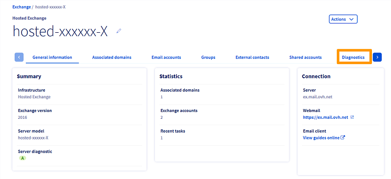

> [!primary]
> Esta traducción ha sido generada de forma automática por nuestro partner SYSTRAN. En algunos casos puede contener términos imprecisos, como en las etiquetas de los botones o los detalles técnicos. En caso de duda, le recomendamos que consulte la versión inglesa o francesa de la guía. Si quiere ayudarnos a mejorar esta traducción, por favor, utilice el botón «Contribuir» de esta página.
>

**Última actualización: 28/05/2021**

## Objetivo

Los errores en las cuentas de correo Exchange pueden tener múltiples causas. Un diagnóstico automático de las funcionalidades de la cuenta permite reducir el número de causas. Los resultados de estas pruebas también serán útiles en caso de solicitar asistencia para su servicio Exchange.

**Esta guía explica cómo ejecutar un diagnóstico Exchange e interpretar los resultados.**

## Requisitos

- Tener una [solución Exchange de OVHcloud](https://www.ovh.com/world/es/emails/hosted-exchange/) ya instalada.
- Disponer de las claves de acceso para la cuenta Exchange que debe verificar.
- Estar conectado al [área de cliente de OVHcloud.](https://ca.ovh.com/auth/?action=gotomanager&from=https://www.ovh.com/world/&ovhSubsidiary=ws)

## Procedimiento

### Realizar un diagnóstico

Conéctese al [área de cliente de OVHcloud](https://ca.ovh.com/auth/?action=gotomanager&from=https://www.ovh.com/world/&ovhSubsidiary=ws) en la sección `Web Cloud`{.action}. Seleccione `Microsoft`{.action} en el menú de la izquierda, haga clic en `Exchange`{.action} y seleccione su servicio.

{.thumbnail}

Abra la pestaña `Diagnóstico`{.action} y seleccione la cuenta Exchange correspondiente en el menú desplegable. Introduzca la contraseña de la cuenta en el campo correspondiente y haga clic en `Iniciar el diagnóstico`{.action}.

{.thumbnail}

El diagnóstico tardará entre 3 y 10 minutos. Aquí hay un ejemplo de los resultados:

{.thumbnail}

La página de resultados propone dos acciones para continuar:

- `Nuevo diagnóstico`{.action}: ejecuta otro diagnóstico.

- `Crear una solicitud de asistencia`{.action}: le permite crear un tíquet a nuestro soporte técnico. El tíquet contendrá los resultados del diagnóstico.

### Explicación de los errores

Consulte el siguiente resumen de posibles errores para encontrar la solución más rápida.

### La cuenta está bloqueada por envío de spam. 

Una cuenta bloqueada siempre recibe mensajes de correo, pero el envío ha sido desactivado por el sistema de protección automática contra el spam.

Puede comprobarlo en la pestaña `Cuentas de correo`{.action} de su servicio Exchange. La cuenta tendrá una mención `SPAM` en la columna "Estado" de la tabla.

Consulte nuestra guía ¿[Qué hacer en caso de cuenta bloqueada por spam?](../bloqueo-por-correo-no-deseado/) para que nuestros equipos de seguridad puedan reactivar la cuenta.

### La suscripción a la cuenta ha expirado. 

La suscripción ya no está activa, por lo que se ha desactivado el envío y la recepción. Puede comprobar el estado de facturación del servicio en el [área de cliente de OVHcloud](https://ca.ovh.com/auth/?action=gotomanager&from=https://www.ovh.com/world/&ovhSubsidiary=ws) y renovarlo para reactivar la cuenta.

### La cuenta está bloqueada por la política de seguridad.

Si una política de seguridad está activada en el [área de cliente de OVHcloud](https://ca.ovh.com/auth/?action=gotomanager&from=https://www.ovh.com/world/&ovhSubsidiary=ws), la cuenta puede bloquearse temporalmente.

Por ejemplo, puede decidir que la cuenta se bloquee después de varios intentos de conexión fallidos, por un período determinado por usted mismo.

En ese caso, puede esperar a que la cuenta vuelva a estar disponible o contactar con nuestro equipo Exchange creando una solicitud de asistencia.

Para más información sobre esta funcionalidad, consulte nuestra [guía sobre la política de seguridad](../configurar-politica-seguridad-exchange/).

### La autenticación en el webmail no ha podido realizarse. 

Esto puede deberse a la introducción de una contraseña de cuenta incorrecta. En primer lugar, compruebe que la contraseña es correcta conectándose al [webmail](../exchange_2016_guia_de_uso_de_outlook_web_app/) y reinicie el diagnóstico.

Si lo necesita, puede cambiar la contraseña de la cuenta en la pestaña `Cuentas de correo`{.action} del [área de cliente de OVHcloud](https://ca.ovh.com/auth/?action=gotomanager&from=https://www.ovh.com/world/&ovhSubsidiary=ws). Si el problema persiste, cree una solicitud de asistencia.

### El registro MX del dominio no es válido

Este error indica que los mensajes de correo no pueden ser recibidos y que también estará relacionado con el error "**ATENCIÓN: El mensaje de correo de prueba no se ha recibido.**".

En función del uso de su servicio Exchange, son válidos los siguientes servidores MX:

- Solo Exchange: mx0.mail.ovh.net, mx2.mail.ovh.net, mx3.mail.ovh.net y mx4.mail.ovh.net
- Exchange + Correo POP/IMAP alojado en OVHcloud: mx0.mail.ovh.net, mx2.mail.ovh.net, mx3.mail.ovh.net y mx4.mail.ovh.net
- Exchange + Correo POP/IMAP no alojado en OVHcloud: ex<b>?</b>.mail.ovh.net

> [!warning]
> En nuestras guías utilizamos como nombre de servidor: ex<b>?</b>.mail.ovh.net. Debe reemplazar el "?" por el número correspondiente al servidor de su servicio Exchange. 
> Puede consultar esta información en el área de cliente de OVHcloud, en la sección `Web Cloud`{.action}.  En el menú de la izquierda, abra `Microsoft`{.action} y seleccione `Exchange`{.action}. El nombre del servidor aparece en la pestaña **Conexión** de la `Información general`{.action}.
>

> [!primary]
>
> El nombre técnico de un servicio Exchange de OVHcloud se compone de un prefijo (**hosted-** o **private-**), una parte de su "identificador de cliente" y un número incremental que indica el número de servicios Exchange alojados o privados registrados en su cuenta de cliente.
>

### El registro SRV del dominio no es válido

El registro SRV sirve para la configuración automática de su cuenta Exchange con un cliente de correo compatible, como Microsoft Outlook.

Puede comprobar estos parámetros en la [zona DNS del dominio](../../domains/web_hosting_como_editar_mi_zona_dns/).

Estos son los valores para un servicio Exchange:

Campo | Valor
------------ | -------------
Prioridad | 0
Peso | 0
Puerto | 443
Destino | [ex<b>?</b>.mail.ovh.net](#hostname) (sustituya "?" por el número correspondiente al servidor de su servicio Exchange)

### El mensaje de correo de prueba no se ha podido enviar desde la cuenta

Este error indica un error general al enviar mensajes de correo que pueden tener varias causas:

- [Su cuenta ha sido suspendida](#expired)
- [La contraseña introducida es incorrecta](#password)
- [Su cuenta ha sido bloqueada por envío de correo no deseado](#blocked)
- [Se produjo un incidente en la infraestructura](http://travaux.ovh.net/?project=31&status=all&perpage=50)

## Más información

Interactúe con nuestra comunidad de usuarios en <https://community.ovh.com/en/>.
